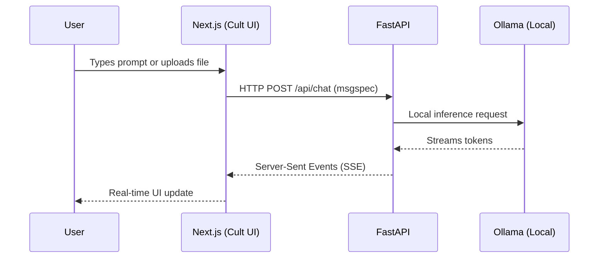
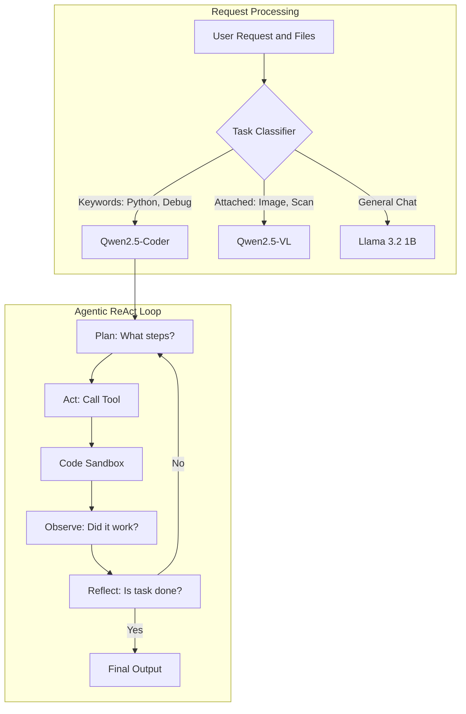
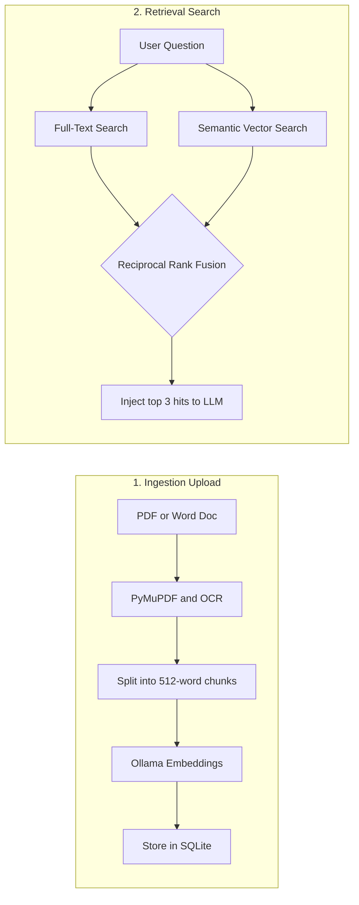
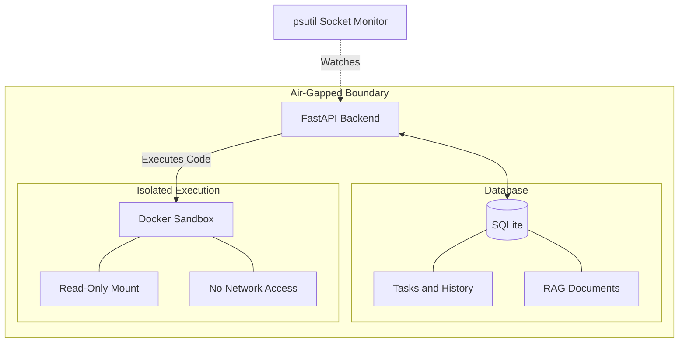

# Kavach AI — Detailed System Architecture

This document breaks down the Kavach AI system into its core components. It is designed to provide step-by-step technical clarity on how data flows, how the AI reasons, and how sovereignty is guaranteed.

---

## 1. Tech Stack & User Flow
*How the user interacts with the system and the technologies powering each layer.*

**Where technologies are used:**
*   **Client (Browser):** React Hooks, Tailwind CSS for styling.
*   **Frontend Server (Port 3000):** Next.js 15 App Router running on **Bun** for maximum speed. Uses Cult UI components for the agentic interface.
*   **Backend Server (Port 8000):** FastAPI running via **UV** and Uvicorn. Uses `msgspec` for ultra-fast JSON serialization.
*   **AI Engine (Port 11434):** Ollama running purely on localhost.

---

## 2. The Auto-Router & Agent Engine
*How the system decides what to do and executes complex tasks without manual model switching.*

**Proof for Judges:** 
If a judge asks how the agent works, show them the **Agent Step View** in the UI. It visually expands to show the `[PLAN]`, `[ACT]`, and `[OBSERVE]` logs generated by this exact ReAct loop.

---

## 3. The On-Premise RAG Pipeline
*How the system ingests and searches internal PSU documents securely.*

**Deep Dive:** 
Unlike basic RAG that only uses vector search (which can miss exact keyword matches like "Section 4.1.2"), Kavach AI uses **Hybrid Search**. We combine SQLite`s FTS5 (Full-Text Search) with semantic vector search, blending the scores using a mathematical algorithm called Reciprocal Rank Fusion (RRF).

---

## 4. Sovereignty, Security & Data Layer
*How we guarantee 100% on-premise execution and data safety.*

**Key Security Features:**
1.  **Zero-Setup Database:** Everything (conversations, vectors, logs) is stored in a single SQLite file via Tortoise ORM. No external database servers needed.
2.  **Code Sandbox:** Python code generated by the AI is executed in an ephemeral, locked-down Docker container with `--network none`.
3.  **The Sovereignty Guard:** Our backend continuously polls system sockets using `psutil`.

**Proof for Judges:**
To prove the system is air-gapped, open the **Network Monitor** tab in the application. It will display a live feed of all socket connections. Ask the judges to disable the host machines Wi-Fi to prove functionality remains at 100%.

---

## 5. Hardware Specifications

Because we utilize optimized small language models (SLMs), the entire architecture described above runs on standard mid-range hardware.

*   **Required GPU:** Single GPU with 6GB+ VRAM (e.g., RTX 3060, RTX 4060).
*   **Total VRAM Used:** ~4.1 GB (Llama 3.2, Qwen-Coder, and Qwen-VL loaded simultaneously).
*   **Model Strategy:** Models are pre-loaded at startup with `keep_alive=-1`, ensuring instant auto-routing with zero cold-start latency.

---

## 6. Competitor Analysis & Differentiation
*Why Kavach AI is uniquely positioned for PSUs and Defence compared to existing solutions.*

| Feature | Kavach AI (Ours) | ChatGPT / Claude | OpenWebUI (Standard) | Standard RAG Chatbots |
| :--- | :---: | :---: | :---: | :---: |
| **100% Air-Gapped / On-Premise** | ? | ? | ? | ? |
| **Zero Cloud Telemetry** | ? | ? | ? (Pulls models dynamically) | ? |
| **Multi-Model Auto-Routing** | ? | ? (Manual switch) | ? (Manual switch) | ? (Single model) |
| **Agentic Tool Sandbox (Docker)** | ? | ? (Advanced Data Analysis) | ? | ? |
| **Native Output (DOCX, XLSX)** | ? | ? (Text only) | ? | ? |
| **Hardware Required** | **6GB VRAM (Consumer)** | N/A (Cloud) | 16GB+ VRAM (usually) | 16GB+ VRAM |

**Proof for Judges:** 
We didn't just build a chat wrapper. The combination of **Auto-Routing + Agentic Sandbox + True Air-Gap** does not exist in lightweight open-source tools today. This table proves we understand the market gap.

---

## 7. Risk Mitigation Strategy
*How we address potential system failures and technical limitations.*

1. **Risk: Hallucination in Critical Scenarios**
   *   *Mitigation:* The On-Premise RAG pipeline forces the model to ground answers in local SOPs. If a tool call fails, the ReAct agent loop explicitly [OBSERVE]s the error and retries or alerts the user, preventing silent failures.
2. **Risk: Hardware Constraints (Out of Memory)**
   *   *Mitigation:* By deliberately selecting SLMs (1B to 3B parameters) and capping total VRAM usage at 4.1GB, we ensure the system cannot crash due to memory exhaustion on our target mid-range hardware. 
3. **Risk: Code Sandbox Breakouts**
   *   *Mitigation:* The code_execute tool runs in a disposable Docker container with --network none, a read-only root filesystem, and dropped capabilities. Even if the AI generates malicious code, it cannot harm the host system or access the internet.
4. **Risk: Model Router Inaccuracy**
   *   *Mitigation:* Instead of relying on a slow, error-prone LLM to route requests, our Task Classifier uses a deterministic keyword and heuristic scoring engine. It routes instantly and defaults safely to the general chat model if uncertain.
